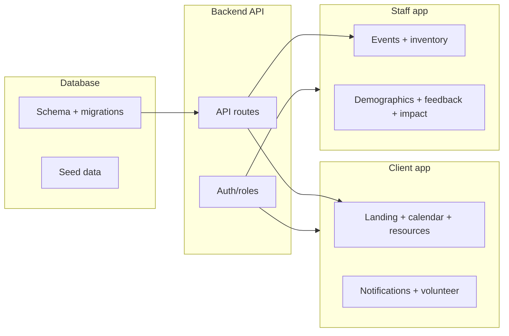

# Hackathon work split and branching plan

Based on your [README.md](README.md) MVP (client-side landing, notifications, volunteer flow; staff-side events/inventory, demographics, feedback, impact page), below is a recommended **TypeScript stack**, **work split**, and **branching strategy**.

---

## Recommended TypeScript stack

| Layer            | Suggestion                                              | Why                                                                                  |
| ---------------- | ------------------------------------------------------- | ------------------------------------------------------------------------------------ |
| **Frontend**     | Next.js (App Router) or React + Vite                    | Shared TypeScript types, SSR/SSG for landing, single app with client vs staff routes |
| **Backend**      | Next.js API routes or standalone Node (Fastify/Express) | TypeScript end-to-end; Next.js keeps repo simple for a hackathon                     |
| **Database**     | PostgreSQL or SQLite + **Prisma** (or Drizzle)          | Shared schema and types; Prisma gives quick migrations and type-safe client          |
| **Shared types** | Monorepo with `shared/` or `packages/types`             | Single source of truth for API and DB shapes                                         |

If you prefer a **single repo**: Next.js full-stack (API routes + React) + Prisma + one database. If you prefer **separate services**: `apps/web` (React/Vite), `apps/api` (Node), `packages/database` (Prisma + schema), still in one repo with TypeScript throughout.

---

## Work split by area (minimizes file overlap)

Splitting by **layer** and **persona** keeps people in different parts of the codebase and reduces merge conflicts.

| Track                          | Owner    | Scope (from MVP)                                                                                                                            | Main files/dirs                                                      |
| ------------------------------ | -------- | ------------------------------------------------------------------------------------------------------------------------------------------- | -------------------------------------------------------------------- |
| **1. Database + shared types** | Person A | Schema for events, inventory, users, notifications, demographics, feedback; Prisma migrations; shared TS types                              | `prisma/`, `src/types/` or `packages/types/`                         |
| **2. Backend API**             | Person B | REST or tRPC endpoints for events, inventory, users, notifications, demographics, feedback; auth/roles (nonprofit vs volunteer vs assistee) | `src/app/api/` or `api/`, `src/lib/auth.ts`                          |
| **3. Client frontend**         | Person C | Landing (event calendar, resource list, action list), notification prefs, volunteer status + interest form, notification testing UI         | `src/app/(client)/` or `src/pages/` client routes, client components |
| **4. Staff frontend**          | Person D | Event/inventory setup and dashboard, demographic form, feedback form, Impact page (totals)                                                  | `src/app/(staff)/` or staff-only routes and components               |

If you have **3 people**: combine Database + Backend (Person A) and keep Client (B) and Staff (C). If you have **5+**: split Backend (auth vs. domain endpoints) or add a dedicated “shared UI components” person.

---

## Branching strategy to avoid merge conflicts

Use **long-lived feature branches by layer/persona** so different people rarely touch the same files.

- `**main`** – deployable; protect it, merge via PRs.
- `**develop`** (optional) – integration branch; feature branches merge here first, then `develop` → `main`.
- **Feature branches** (one per track, rebase or merge from `main`/`develop` regularly):

| Branch                 | Owned by | Contains                                |
| ---------------------- | -------- | --------------------------------------- |
| `feat/database-schema` | Person A | Prisma schema, migrations, shared types |
| `feat/backend-api`     | Person B | API routes, auth, server-only libs      |
| `feat/client-app`      | Person C | Client-side pages and components        |
| `feat/staff-app`       | Person D | Staff-side pages and components         |

**Merge order (to avoid blocking):**

1. Merge `**feat/database-schema`** first (no dependency on others).
2. Merge `**feat/backend-api`** next (depends on schema/types).
3. Merge `**feat/client-app`** and `**feat/staff-app`** in any order (both depend on API; they mostly touch different routes/components).

**Conflict reduction:**

- Backend and database both touch `prisma/` and possibly `src/types/`. Have **one person own** schema and types; the backend person consumes them and avoids editing schema in parallel.
- Frontend: strict **route separation** (e.g. `(client)/` vs `(staff)/`) and **no shared component edits** in the same sprint if possible; otherwise coordinate on shared components (e.g. one person owns `Button`, `Modal`).

**Daily workflow:**

- Pull `main` (or `develop`) at start of day; rebase or merge into your feature branch.
- Keep feature branches **short-lived** (e.g. 1–2 days) and merge often so integration stays smooth.

---

## Implementation order (recommended)

1. **Day 0 / setup:** Repo scaffold (Next.js or React + Node), Prisma init, ESLint/TypeScript config, folder structure (`(client)/`, `(staff)/`, `api/`).
2. **Database first:** Define schema (users, events, inventory, notifications, demographics, feedback); add migrations and optional seed; export shared types.
3. **Backend next:** Implement auth (simple session or JWT) and role checks; add API routes for events, inventory, notifications, demographics, feedback; backend owner consumes shared types only, no schema changes.
4. **Frontends in parallel:** Client and staff can start once a few core endpoints exist; use mocks or minimal API until routes are ready. Integrate real API as endpoints land.

---

## Summary

- **Stack:** TypeScript everywhere; Next.js (or React + Node), Prisma, PostgreSQL or SQLite; shared types in one place.
- **Split:** Database + types → Backend API → Client app → Staff app (4 tracks; collapse to 3 if needed).
- **Branches:** `feat/database-schema`, `feat/backend-api`, `feat/client-app`, `feat/staff-app`; merge in that order; one owner for schema to avoid conflicts.
- **Order:** Scaffold → schema & types → API & auth → client and staff UIs in parallel, merging feature branches frequently into `main` (or `develop`).

This keeps client vs staff and backend vs frontend in separate parts of the repo and branches, so your team can move fast with minimal merge conflicts during the hackathon.